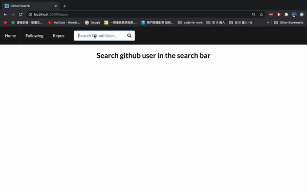

# Github-Search

Github-Search is a web app that features github API to search for github users. the functionality includes find user, look for his/her followers and who he/she is following. Also, you could look at one of the repos and check the repo if it's private or not.

Primary technologies used: React, github API, React Hooks, Semantic-UI.

## Setup

Follow the following steps to setup and run the apps on your local:

1. Clone the github repo
2. Type 'npm install' in the terminal while in the repo's directory
3. Type 'npm start' in the terminal while in the repo's directory
4. After a few seconds the app should be ready on your localhost:3000

## Demo GIFs

### Dependencies

"@testing-library/jest-dom": "^4.2.4",
"@testing-library/react": "^9.5.0",
"@testing-library/user-event": "^7.2.1",
"axios": "^0.20.0",
"node-sass": "^4.14.1",
"react": "^16.13.1",
"react-dom": "^16.13.1",
"react-router-dom": "^5.2.0",
"react-scripts": "3.4.3",
"semantic-ui-css": "^2.4.1",
"semantic-ui-react": "^2.0.0"
